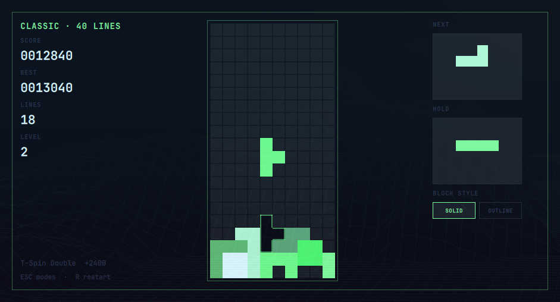

# Omatris

A clean, theme-aware Tetris-inspired falling-block game for the Omarchy Quattro
shell. It runs in a native resizable window, follows the active Omarchy palette
and needs no external runtime dependencies.



## Modes

- **Classic** — clear 40 lines; speed increases every 10 lines.
- **Endless** — keep playing until top-out and chase a high score.
- **Practice** — adjustable gravity; top-outs clear the board instead of ending the run.
- **Overlay (experimental)** — choose a suitable window on the current workspace
  and play on a transparent board aligned to its bottom edge.

Classic, Endless, and Overlay keep separate local high scores. Omatris uses
SRS+ rotation: standard SRS wall and floor kicks with TETR.IO-style symmetric
I-piece kicks. T-spins and T-spin minis are detected and scored.

Overlay mode temporarily takes keyboard focus while leaving the target window
visible underneath. Compact Hold and Next previews scale into the side space
beside the board. Press `Esc` to return to the picker. The first prototype is
limited to visible windows on the current workspace and exits if the target is
closed, hidden, or moved away.

Every menu can be operated without a mouse: use the arrow keys to move the
highlight and `Enter` or `Space` to activate it.

Omatris includes an original synthesized soundtrack and responsive effects for
movement, rotation, drops, locks, line clears, T-spins, and game over. Music and
effects levels are stored locally and can be adjusted independently in Settings.

Omatris is a single-session plugin. Opening it from the bar, a shell hotkey, or
`omarchy-shell shell summon` reuses the same loaded panel; a repeated summon
will not create another window or reset an active game or overlay.

## Installation

Omatris requires the Omarchy Quattro shell and has no additional runtime
dependencies. Install and enable it directly from GitHub:

```bash
omarchy plugin add https://github.com/Akira-80kv/omatris.git --enable
```

That single command downloads the plugin, validates its manifest, and adds the
Omatris icon to the right side of the bar. Click the icon to open it.

To place the icon somewhere else, move it with Omarchy's bar command:

```bash
omarchy bar move com.80kv.omatris --section left
omarchy bar move com.80kv.omatris --section center
omarchy bar move com.80kv.omatris --section right
```

Only run the command for the position you want. You can also open Omatris from
a keybinding or terminal without creating another instance:

```bash
omarchy-shell shell summon com.80kv.omatris '{}'
```

## Updating

If Omatris was installed from GitHub, update it with:

```bash
omarchy plugin update com.80kv.omatris
```

Omarchy fetches the latest release, shows the changes for confirmation,
validates the updated plugin, and refreshes the shell plugin registry. Your
local high scores, audio levels, custom controls, and global shortcut are kept.
If the shell still displays a cached older version, reload it once:

```bash
omarchy restart shell
```

For a local development checkout, pull the repository and refresh the installed
copy instead:

```bash
git pull --ff-only
./scripts/install-local.sh
```

To remove Omatris:

```bash
omarchy plugin remove com.80kv.omatris
```

## Local development

Run the automated manifest and game-engine checks:

```bash
./scripts/check.sh
```

Launch Omatris in a temporary Quickshell development window:

```bash
./scripts/run-dev.sh
```

Closing the window removes the temporary runtime files. This does not install,
enable, or publish the plugin, and it does not modify your Omarchy shell layout.

Install or refresh the local development copy:

```bash
./scripts/install-local.sh
```

The plugin includes a theme-aware bar icon. Once installed, enable and place it
on the right side of the bar with:

```bash
omarchy plugin enable com.80kv.omatris --section right --after omarchy.agents
```

During local development, place or clone the repository at
`~/.config/omarchy/plugins/com.80kv.omatris`, then run:

```bash
omarchy plugin validate ~/.config/omarchy/plugins/com.80kv.omatris
omarchy plugin enable com.80kv.omatris
omarchy-shell shell summon com.80kv.omatris '{}'
```

You can summon a mode directly with a JSON payload:

```bash
omarchy-shell shell summon com.80kv.omatris '{"mode":"practice"}'
```

## Controls

| Key | Action |
| --- | --- |
| Arrow keys | Navigate menus |
| Enter or Space | Select a menu action |
| Arrow left/right or A/D | Move |
| Arrow down or S | Soft drop |
| X or Arrow up | Rotate clockwise |
| Z | Rotate counter-clockwise |
| Space | Hard drop |
| C or Shift | Hold |
| B | Switch solid/outline block style |
| P | Pause |
| R | Restart |
| M | Mute audio |
| Escape | Mode menu / close |

Gameplay controls have two editable slots per action. Open **Settings** from
the mode menu, select either slot, and press the replacement key. Duplicate
keys are reassigned automatically; Escape remains reserved as a safe way back.

Settings also includes a global **Open Omatris** shortcut. Select its box and
press a combination containing Super, Ctrl, or Alt. Omatris checks the active
Hyprland bindings and identifies conflicts without replacing them. Press
`Delete` or `Backspace` while editing the box to remove the shortcut.

The bundled audio is generated from original synthesis code. To regenerate it:

```bash
node scripts/generate-audio.js
```

## Theme integration

The window uses Omarchy's live `Color` and `Style` tokens. Backgrounds,
foregrounds, accents, urgency colors, fonts, borders, and corner radii update
with the current theme. Tetromino colors are derived from the same palette, so
they stay distinct without clashing with the desktop.

## Roadmap

Ideas planned for future releases:

- Persistent play statistics.
- Customizable movement repeat timing and drop behavior.
- Colorblind-friendly and higher-contrast piece palettes.
- Controls for overlay opacity, guides, and preview visibility.

The first release stays intentionally focused: a polished core game, live
Omarchy theming, keyboard-first menus, and the experimental window Overlay.

## Publish

Before submitting a release to the marketplace, add a screenshot and run:

```bash
./scripts/check.sh
```

Keep the repository public with `manifest.json`, this README, and `LICENSE` in
its root. Then submit the repository URL at
[omarchyplugins.com/publish.html](https://omarchyplugins.com/publish.html).

## License

MIT
